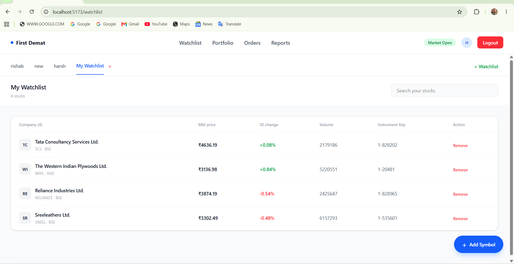
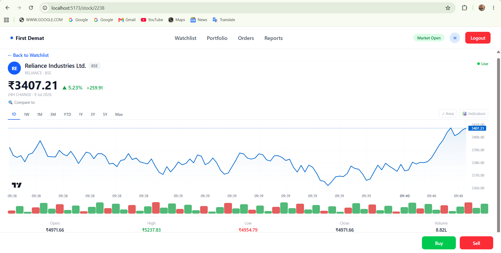

# First Demat Watchlist

A React + Vite frontend project for a stock watchlist application.

## Watchlist UI

 

## Stock Detail UI



## Features

- Stock search from backend API
- NSE and BSE stock support
- Add stocks to watchlist
- Debounced search after 500ms
- Minimum 2 characters required for search
- Stock detail page with chart
- Live price/socket status
- Buy and Sell buttons

## Tech Stack

- React
- Vite
- Tailwind CSS
- JavaScript
- REST API
- Lightweight Charts

## Run Locally

```bash
npm install
npm run dev
